<!-- .slide: data-background-image="https://cdn.geotribu.fr/img/slides/2025/qgisfr_geotribu-x-qgis/osgeo_qgis_rencontres_fr_2025_cover_bg.png" data-background-size="cover" -->

## QChat

:speech_balloon: Un _chat_ dans QGIS et QField !

**#QGISFR2025** - 11 Juin 2025 - Avignon

Guilhem Allaman -  [@guilhem_allaman@mapstodon.space](https://mapstodon.space/@guilhem_allaman)

[Geotribu](https://geotribu.fr/) -   [@geotribu@mapstodon.space](https://mapstodon.space/@geotribu)

[OPENGIS.ch](https://www.opengis.ch/) -   [@opengisch@fosstodon.org](https://fosstodon.org/@opengisch)

----

<!-- .slide: data-background-image="https://cdn.geotribu.fr/img/slides/2025/qgisfr_geotribu-x-qgis/osgeo_qgis_rencontres_fr_2025_slide_bg.png" data-background-size="cover" -->

## :question: QChat: préparez-vous ! :question:

Un quizz est prévu en fin de séance :wink:, comment participer ?

- soit ouvrir QGIS puis installer le plugin [`QTribu`](https://plugins.qgis.org/plugins/qtribu/) et renseigner votre pseudo dans les paramètres
- soit ouvrir [`https://gischat.geotribu.net`](https://gischat.geotribu.net) dans un navigateur :

----

<!-- .slide: data-background-image="https://cdn.geotribu.fr/img/slides/2025/qgisfr_geotribu-x-qgis/osgeo_qgis_rencontres_fr_2025_slide_bg.png" data-background-size="cover" -->

### QChat : comment ça a commencé

Un jour... En juillet 2024...

----

<!-- .slide: data-background-image="https://cdn.geotribu.fr/img/slides/2025/qgisfr_geotribu-x-qgis/osgeo_qgis_rencontres_fr_2025_slide_bg.png" data-background-size="cover" -->

### :iphone: Coup de fil spontané

Avec Julien Moura (complice de Geotribu) :

- Et si on tchattait dans QField ?
- Et si on tchattait dans QField **et** dans QGIS ?
- Mais... Pourquoi, en fait !?
- Et pourquoi pas ?

Inutile, donc indispensable !

----

<!-- .slide: data-background-image="https://cdn.geotribu.fr/img/slides/2025/qgisfr_geotribu-x-qgis/osgeo_qgis_rencontres_fr_2025_slide_bg.png" data-background-size="cover" -->

### Commençons par un plugin QGIS

Le plugin QGIS [QTribu](https://plugins.qgis.org/plugins/qtribu/) existe déjà :

- fonctionnel
- enregistré sur `plugins.qgis.org`
- CICD opérationnelle

_Fun fact: le plugin QTribu a été créé un 1er avril..._

----

<!-- .slide: data-background-image="https://cdn.geotribu.fr/img/slides/2025/qgisfr_geotribu-x-qgis/osgeo_qgis_rencontres_fr_2025_slide_bg.png" data-background-size="cover" -->

### Objectifs de QChat

- ajouter du fun dans QGIS
- s'amuser à développer ce tchat
- rencontrer les sigistes les plus :fire: de ta région, ou à l'autre bout du monde - Qt-inder™
- ouvrir des nouveaux usages : support & assistance, échanges entre bureau et terrain, etc.

----

<!-- .slide: data-background-image="https://cdn.geotribu.fr/img/slides/2025/qgisfr_geotribu-x-qgis/osgeo_qgis_rencontres_fr_2025_slide_bg.png" data-background-size="cover" -->

### QChat au début

- Étudier les standards ouverts de chat déjà existants (IRC, jabber, matrix...)  
-> Commençons simple, "Keep it simple", [K.I.S.S.](https://en.wikipedia.org/wiki/KISS_principle) :kissing_heart:
- Ouvert et accessible pour tout un chacun  
-> T'as un QGIS -> Tu peux tchatter :speech_balloon:

----

<!-- .slide: data-background-image="https://cdn.geotribu.fr/img/slides/2025/qgisfr_geotribu-x-qgis/osgeo_qgis_rencontres_fr_2025_slide_bg.png" data-background-size="cover" -->

### Développement du plugin QGIS QTribu

- Au début: le méchanisme [`LISTEN`](https://www.postgresql.org/docs/current/sql-listen.html) / [`NOTIFY`](https://www.postgresql.org/docs/current/sql-notify.html) de PostgreSQL considéré
- Choix: connexions de websockets au server -> [`QtWebSockets`](https://doc.qt.io/qt-6/qtwebsockets-index.html) disponible en `pyqgis` :thumbsup:
- Paramètres [en utilisant le templater de plugins QGIS](https://oslandia.gitlab.io/qgis/template-qgis-plugin/)
- `QgsDockWidget` -> fluide et en parallèle du canvas de QGIS

----

<!-- .slide: data-background-image="https://cdn.geotribu.fr/img/slides/2025/qgisfr_geotribu-x-qgis/osgeo_qgis_rencontres_fr_2025_slide_bg.png" data-background-size="cover" -->

### Fonctionnalités de QChat

- Envoyer des messages textes basiques
- Incarner _jusqu'au bout de ses ongles_ un _avatar_ (icônes natives de QGIS)
- Mentionner les autres avec `@jane_doe` / `@all`
- Notifications: barre des messages de QGIS, sons...
- Liker des messages :thumbsup:
- Partager des données vecteur légères, des images, des screenshots de son QGIS, des SCR, des bbox...

----

<!-- .slide: data-background-image="https://cdn.geotribu.fr/img/slides/2025/qgisfr_geotribu-x-qgis/osgeo_qgis_rencontres_fr_2025_slide_bg.png" data-background-size="cover" -->

### Serveur QChat

- "gischat": [dépôt sur GitHub](https://github.com/geotribu/gischat) #gischat
- En python avec _FastAPI_
- Dispatcher de websockets
- Pas de bases de données: simplement des websockets _stateless_ :kissing_heart:
- Image docker sur [DockerHub](https://hub.docker.com/r/gounux/gischat) et [GHCR](https://github.com/geotribu/gischat/pkgs/container/gischat)
- Déployable sur un serveur assez simplement  
-> 1 service + quelques variables d'environnement

----

<!-- .slide: data-background-image="https://cdn.geotribu.fr/img/slides/2025/qgisfr_geotribu-x-qgis/osgeo_qgis_rencontres_fr_2025_slide_bg.png" data-background-size="cover" -->

### Système QChat - gischat

```mermaid
%%{init: {'theme':'forest', 'themeVariables': {'background':'transparent'}}}%%

graph LR
    subgraph Clients QChat
        QGISA[💻 QChat QGIS 1]
        QGISB[💻 QChat QGIS 2]
        QFieldA[📱 QChat QField]
    end
    subgraph Serveur gischat
        WSDispatcher[🚠 Websocket Dispatcher]
        WSStorage[🗳️ Websocket Rooms Storage]
    end

    QGISA --> |1️⃣👋 Ouvre une connexion pour une room| WSDispatcher
    WSDispatcher --> |2️⃣✅ Enregistre la connexion pour la room| WSStorage

    QGISB --> |3️⃣📦 Envoie un message dans une room| WSStorage
    WSStorage --> |4️⃣📦 Diffuse le message à la room| QGISA
    WSStorage --> |5️⃣📦 Diffuse le message à la room| QFieldA
```

----

<!-- .slide: data-background-image="https://cdn.geotribu.fr/img/slides/2025/qgisfr_geotribu-x-qgis/osgeo_qgis_rencontres_fr_2025_slide_bg.png" data-background-size="cover" -->

### Instances de chat QChat - gischat

2 serveurs connus à l'heure actuelle:

- `gischat.geotribu.net`
-> pour tout le monde, en anglais
- `gischat.geotribu.fr`
-> pour tout le monde, en français

Aussi: :phone: [annuaire des instances connues et découvrables](https://github.com/geotribu/gischat/blob/main/instances.json) sur le dépôt GitHub

----

<!-- .slide: data-background-image="https://cdn.geotribu.fr/img/slides/2025/qgisfr_geotribu-x-qgis/osgeo_qgis_rencontres_fr_2025_slide_bg.png" data-background-size="cover" -->

### Plugin QChat pour QField

:thumbsup: Crédits à Mathieu Pellerin - [@nirvn](https://github.com/nirvn)

----

<!-- .slide: data-background-image="https://cdn.geotribu.fr/img/slides/2025/qgisfr_geotribu-x-qgis/osgeo_qgis_rencontres_fr_2025_slide_bg.png" data-background-size="cover" -->

### QField Plugins Framework

_Live_ depuis printemps 2024 :

- Ajouter de la logique custom et métier à l'app QField :
  - À l'échelle d'un projet, déployable avec QFieldCloud
  - À l'échelle de l'application (paramètres)
- Développement en JavaScript / QML ([_Qt Meta-object Language_](https://doc.qt.io/qt-6/qtqml-index.html))

----

<!-- .slide: data-background-image="https://cdn.geotribu.fr/img/slides/2025/qgisfr_geotribu-x-qgis/osgeo_qgis_rencontres_fr_2025_slide_bg.png" data-background-size="cover" -->

### Plugins QField : exemple - 1/3

#### [OSRM Routing plugin](https://github.com/opengisch/qfield-osrm)

- Calculer un plus court chemin avec une API
- API OSRM - OpenStreetMap Germany
- -> dynamique -> appel et requêtes à des APIs externes

----

<!-- .slide: data-background-image="https://cdn.geotribu.fr/img/slides/2025/qgisfr_geotribu-x-qgis/osgeo_qgis_rencontres_fr_2025_slide_bg.png" data-background-size="cover" -->

### Plugins QField : exemples - 2/3

#### [Weather Forecast plugin](https://github.com/opengisch/qfield-weather-forecast)

- Avoir la visu des prédictions météo dans QField (Open-Meteo)
- Couches en _overlay_ dans QField

----

<!-- .slide: data-background-image="https://cdn.geotribu.fr/img/slides/2025/qgisfr_geotribu-x-qgis/osgeo_qgis_rencontres_fr_2025_slide_bg.png" data-background-size="cover" -->

### Plugins QField : exemples - 3/3

#### Plugin "Christmas Theme"

- Customiser l'interface graphique de QField
- _"Brander"_ l'UI pour des partenaires / sous-traitants

----

<!-- .slide: data-background-image="https://cdn.geotribu.fr/img/slides/2025/qgisfr_geotribu-x-qgis/osgeo_qgis_rencontres_fr_2025_slide_bg.png" data-background-size="cover" -->

### QField Plugins Framework

- En l'état : documentation pas forcément triviale à utiliser (dépôt GitHub)
- [_Cookbook_](https://docs.qfield.org/reference/plugins/) pour le développement de plugins QField
- Prévu d'améliorer la doc d'ici fin 2025
- Travaux en cours sur un dépôt de plugins QField -> plus simple à installer

----

<!-- .slide: data-background-image="https://cdn.geotribu.fr/img/slides/2025/qgisfr_geotribu-x-qgis/osgeo_qgis_rencontres_fr_2025_slide_bg.png" data-background-size="cover" -->

### :speech_balloon: Demo de QChat - QGIS & QField

<iframe
  src="https://video.osgeo.org/videos/embed/hAuB4Ze4gE2fgq9upbdxGm"
  style="width: 80%; aspect-ratio: 16 / 9;"
  frameborder="0"
  allowfullscreen
  sandbox="allow-same-origin allow-scripts allow-popups">
</iframe>

----

<!-- .slide: data-background-image="https://cdn.geotribu.fr/img/slides/2025/qgisfr_geotribu-x-qgis/osgeo_qgis_rencontres_fr_2025_slide_bg.png" data-background-size="cover" -->

### Et maintenant ?

- Quelques personnes sur QChat, parfois...
- On fix des bugs, parfois...
- _Test coverage_ du serveur: `~94%` :smirk: :sunglasses: (< 500 lignes de code)
- Plugin amélioré grâce aux retours des utilisateurs

----

<!-- .slide: data-background-image="https://cdn.geotribu.fr/img/slides/2025/qgisfr_geotribu-x-qgis/osgeo_qgis_rencontres_fr_2025_slide_bg.png" data-background-size="cover" -->

### Retour d'expérience

- Sympa de se frotter et d'éprouver la robustesse de QGIS / Qt (websockets, etc).
- Découverte du framework de plugins QField :+1:
- Un peu l'impression d'avoir fait son protocole de messagerie dans son coin...

----

<!-- .slide: data-background-image="https://cdn.geotribu.fr/img/slides/2025/qgisfr_geotribu-x-qgis/osgeo_qgis_rencontres_fr_2025_slide_bg.png" data-background-size="cover" -->

### Et la suite ?

- Créer et publier un plugin appelé "`QChat`" sur le dépôt officiel
- Créer des compatibilités / "bridges" avec les serveurs `matrix` (complexe !)
- D'autres trucs sympa: des emojis, des sons, des "threads", des easter eggs...
- Une UI plus fluide avec du QML -> partage de code entre les plugins QGIS et QField
- Partager des modèles graphiques ? Partager du code `pyqgis` ?

-> QGIS Remote Desktop ? Intéressant pour support & assistance

----

<!-- .slide: data-background-image="https://cdn.geotribu.fr/img/slides/2025/qgisfr_geotribu-x-qgis/osgeo_qgis_rencontres_fr_2025_slide_bg.png" data-background-size="cover" -->

### Merci

C'est le moment du quizz !

----

<!-- .slide: data-background-image="https://cdn.geotribu.fr/img/slides/2025/qgisfr_geotribu-x-qgis/osgeo_qgis_rencontres_fr_2025_slide_bg.png" data-background-size="cover" -->

### :question: Quizz :question:

3 manières de participer:

- dans QGIS, avec QChat dans le plugin `QTribu`
- dans QField, avec le plugin QChat
- URL: [`https://github.com/geotribu/qchat-qfield-plugin/releases/download/0.1.0/qfield-plugin-qchat.zip`](https://github.com/geotribu/qchat-qfield-plugin/releases/download/0.1.0/qfield-plugin-qchat.zip)
- dans un navigateur: [`https://gischat.geotribu.net`](https://gischat.geotribu.net) :

----

<!-- .slide: data-background-image="https://cdn.geotribu.fr/img/slides/2025/qgisfr_geotribu-x-qgis/osgeo_qgis_rencontres_fr_2025_slide_bg.png" data-background-size="cover" -->

### :question: Quizz :question:

En quelle année a été créé QGIS ?

_Indice: le mur de Berlin était déjà tombé, mais QGIS IV n'était pas encore sorti._

----

<!-- .slide: data-background-image="https://cdn.geotribu.fr/img/slides/2025/qgisfr_geotribu-x-qgis/osgeo_qgis_rencontres_fr_2025_slide_bg.png" data-background-size="cover" -->

### :question: Quizz :question:

À 10 000 près, combien de commits y-a-t'il à date sur le dépôt QGIS ?

_Indice: plus que le nombre de personnes qui utilisent ArqMap, moins que le nombre de code d'erreurs possibles dans ArcGisse._

----

<!-- .slide: data-background-image="https://cdn.geotribu.fr/img/slides/2025/qgisfr_geotribu-x-qgis/osgeo_qgis_rencontres_fr_2025_slide_bg.png" data-background-size="cover" -->

### :question: Quizz :question:

Combien existe-t-il à date de plugins QField ?

_c.à.d. nombre de dépôts GitHub avec le tag `qfield-plugin`._

_Indice:_

<section data-markdown>$$ \left( \frac{7!}{(3! \cdot 2^3)} - \int_{0}^{1} e^x \, dx + \ln(e^2) \right) + \left( \frac{1}{2} \cdot \sqrt{36} \right) $$</section>

----

<!-- .slide: data-background-image="https://cdn.geotribu.fr/img/slides/2025/qgisfr_geotribu-x-qgis/osgeo_qgis_rencontres_fr_2025_slide_bg.png" data-background-size="cover" -->

### :question: Quizz :question:

Combien de dépôts publics contient l'organisation GitHub Geotribu ?

_Indice: entre 0 et 1 million._

----

<!-- .slide: data-background-image="https://cdn.geotribu.fr/img/slides/2025/qgisfr_geotribu-x-qgis/osgeo_qgis_rencontres_fr_2025_slide_bg.png" data-background-size="cover" -->

### :question: Quizz :question:

De quelle année date le premier article dans Geotribu ?

_Indice: cette année-là, Johnny chantait "Ça n'finira jamais"._

----

<!-- .slide: data-background-image="https://cdn.geotribu.fr/img/slides/2025/qgisfr_geotribu-x-qgis/osgeo_qgis_rencontres_fr_2025_slide_bg.png" data-background-size="cover" -->

### Merci

_Remerciement spécial à [Mathieu Pellerin](https://github.com/nirvn) et [Julien Moura](https://github.com/guts) :thumbsup:_

À l'avenir, n'hésitez pas à passer une tête dans QChat !

----

<!-- .slide: data-background-image="https://cdn.geotribu.fr/img/slides/2025/qgisfr_geotribu-x-qgis/osgeo_qgis_rencontres_fr_2025_last_bg.png" data-background-size="cover" -->
